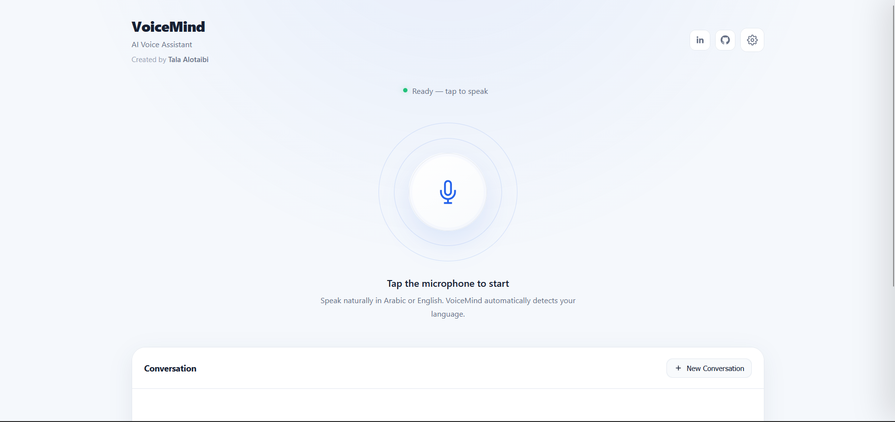
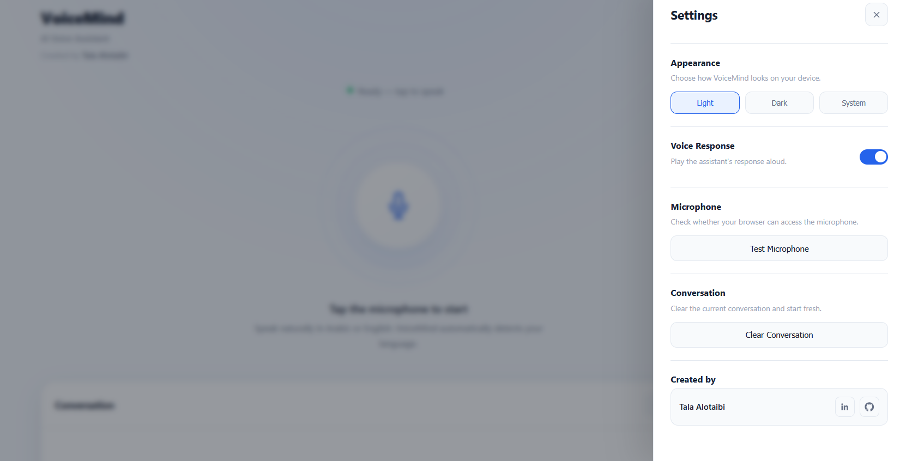

# VoiceMind — AI Voice Assistant

VoiceMind is an AI-powered voice assistant that enables natural voice interaction between the user and an AI system.

It combines **Speech-to-Text**, **AI response generation**, and **Text-to-Speech**, with automatic support for **Arabic and English**.

## Features

- Voice-based interaction
- Arabic and English support
- Automatic language detection
- AI-generated responses
- Voice responses
- Conversation memory
- New conversation option
- Light and Dark mode

## Technologies

- Python
- Whisper
- Cohere
- gTTS
- Flask
- HTML
- CSS
- JavaScript

## How It Works

**1. Speech-to-Text**

The user's voice is processed using Whisper, which converts speech into text and detects the spoken language.

**2. AI Response**

The transcribed text is sent to Cohere, which generates a natural and concise response while maintaining the conversation context.

**3. Text-to-Speech**

The AI response is converted into speech using gTTS and played back to the user.

### Workflow

User Speech  
↓  
Whisper  
↓  
Speech-to-Text + Language Detection  
↓  
Cohere  
↓  
AI Response  
↓  
gTTS  
↓  
Voice Response

## Main Components

### Whisper

Used for Speech-to-Text and automatic language detection.

### Cohere

Used to generate AI responses based on the user's speech.

### gTTS

Converts the AI-generated text into speech.

### Flask

Connects the AI processing with the web application.

## Example

### English

**User:**  
How are you?

**VoiceMind:**  
I'm doing well! How can I help you?

### Arabic

**User:**  
كيف حالك؟

**VoiceMind:**  
أنا بخير! كيف يمكنني مساعدتك؟

## Future Improvements

- Real-time voice interaction
- Additional language support
- More voice options
- Persistent conversation history
- Cloud deployment
- Improved speech recognition

## Project Preview 

